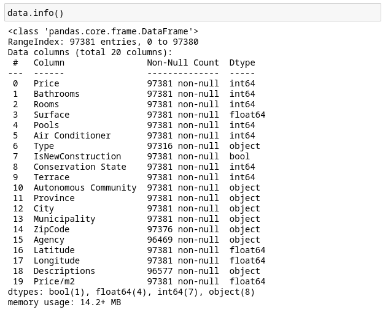

Let's have a look at the dataframe.

We see there are 97381 rows and 20 columns:

For this dataset, the average price for a house is 231k euros, with a standard deviation of 251k euros, and a min-max of 100k and 2315k euros, respectively. An average of 1.81 bathrooms, 1.4 rooms and 142 m².

Now that we have an idea of what the dataframe is all about, let's look at the columns we are interested in the most; price:

Most of the dataset falls below the 500k euros price.  

The surface/price scatter plot is quite interesting. It's hard to see a correlation between these two as it is. But I suspect it has something to do with the fact that this plot is representing all of Spain's properties, with all that implies; really expensive and crowded areas together with really cheap and non-demanded ones. We can't expect to see the same kind of correlation between these attributes in all of the Spanish territory.

`data.Price.corr(data.Surface)`  
`0.5215132157089898`

Let's try with a narrowed down dataset, like the city of Madrid:

`madrid = data.loc[data['Autonomous Community'] == "madrid"]`

`madrid.Price.corr(madrid.Surface)`
`0.6996692428008178`

Even with a good amount of outliers we start seeing the correlation between price and surface increases. In fact, the correlation between many attributes increases:

Spain

Madrid

This proves that location is a key aspect when it comes to getting insights on house prices and the correlation between surface and price.

Let's have a look at the price/m² column:
`plt.figure(figsize=(30,30))
plt.hist(data['Price/m2'], bins=10)        
   plt.show()`
